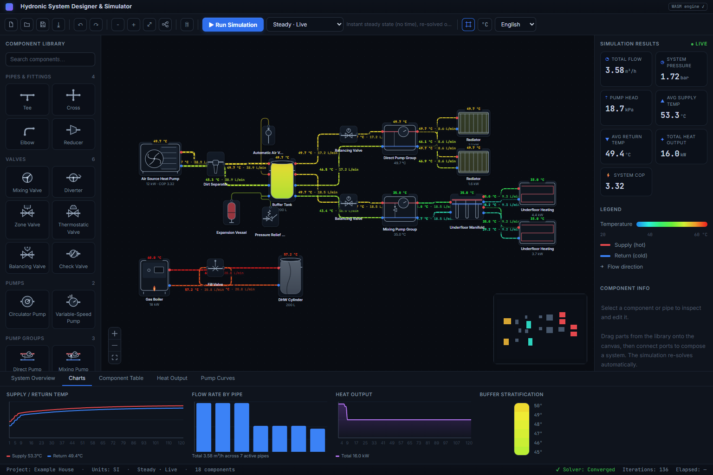

# Hydronic System Designer & Simulator

A React + Redux web app for **composing complex hydronic (water-based) heating
systems** on a node-graph canvas and simulating them with a real steady-state
hydraulic + thermal solver. Reproduces the layout and behaviour of the reference
SCADA-style tool: component palette, schematic canvas, live results, legend,
component inspector, and charts.



## Run

```bash
cd app
npm install
npm run dev        # http://localhost:5173
```

`npm run build` produces a static bundle; `npm run typecheck` runs `tsc`.

## What it does

- **Compose**: drag components from the library onto the canvas, wire supply/
  return ports into loops, move/select/delete, pan/zoom.
- **Simulate**: every edit re-solves automatically (debounced) or on **Run
  Simulation**. Pipes are coloured by temperature, flow animates along them, and
  temperature chips annotate the schematic.
- **Inspect**: select any component or pipe to read its solved state and edit its
  parameters; results update live.
- **Read out**: global results (flow, pressure, supply/return temps, ΔT, heat
  output, COP), a temperature legend, and charts (supply/return convergence,
  per-pipe flow, heat output, buffer stratification, pump curves, energy
  balance, data table).

The seeded "Example House" is an air-source heat pump driving a buffer tank and
hydraulic separator, feeding pumped radiator and underfloor loops, with a gas
boiler on a separate DHW loop and safety components tapped on.

## Architecture

```
app/src/
  model/        domain types, component catalog (single source of truth), colors
  store/        Redux Toolkit slices (graph, selection, sim, ui), seed, factory
  canvas/       React Flow canvas, custom equipment nodes + temperature pipe edges
  components/   palette, toolbar/menu, results+legend+inspector, charts, status bar
  solver/       worker boundary: contract, TS reference solver, wasm bridge, client
  public/solver/  Rust→WASM solver build output (hydro_solver.js + _bg.wasm)
solver/         Rust crate (cargo), compiled to wasm via wasm-pack
```

### Solver

The physics runs in a **Web Worker** behind a small JSON contract
(`app/src/solver/contract.ts`), so the UI never blocks. Two interchangeable
engines implement the same contract:

- **Rust → WebAssembly** (`solver/`, built to `app/public/solver/`) — the
  intended production engine.
- **TypeScript reference** (`app/src/solver/tsSolver.ts`) — the trusted model and
  fallback.

The worker prefers wasm but **validates each result** (converged, positive flow,
no sub-ambient temps) and falls back to the TS engine otherwise; the engine
actually used for each solve is reported back and shown in the toolbar pill.

Both engines model the network as a port-level graph:

- **Hydraulics** — linear-theory nodal iteration. Pipes are Darcy resistances
  (ΔP = K·Q·|Q|). A pump is a node whose internal in→out branch supplies a
  constant head `h0` with a branch resistance sized to `h0/qMax²`, giving a
  proper falling pump characteristic that bounds flow to `[0, qMax]`.
- **Thermal** — component-sweep energy balance to convergence: sources add heat
  capped at their max supply (heat-pump COP from a temperature curve); emitters
  shed `Q = UA·(T_mean − T_room)^n` (solved by bisection); tanks/separators/
  manifolds mix all inflows and feed the mix to every outlet; valves blend toward
  a target; DHW cylinders draw a standby load.

Adding a component type is a single entry in `model/catalog.ts` (category, ports,
default params, solver role) plus an SVG in `canvas/glyphs.tsx`.
